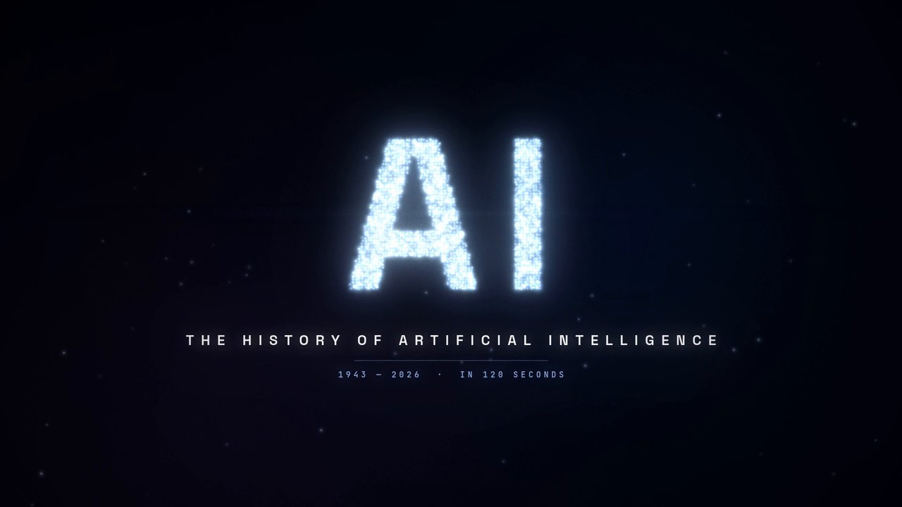
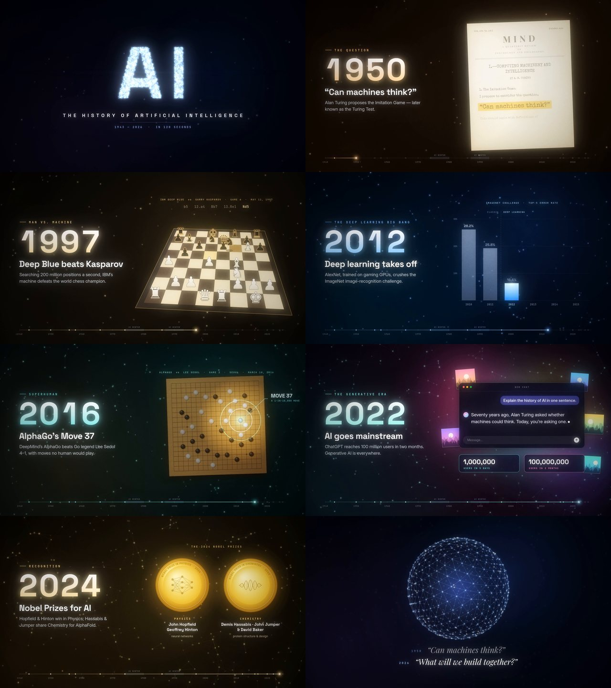

# The History of AI — in 120 seconds

[](https://github.com/carljings/ai-history-video/releases/download/v1.0/ai_history.mp4)

**▶ [Watch / download the video (MP4, 1080p60, 2:00)](https://github.com/carljings/ai-history-video/releases/download/v1.0/ai_history.mp4)**

A two-minute motion-graphics film about the history of artificial intelligence, from the first artificial neuron (1943) to machines that reason (2025). Everything is generated from code: every frame is drawn on an HTML canvas, and the soundtrack and sound effects are synthesized in Python.



## Chapters

| Time | Year | Chapter |
|---|---|---|
| 0:08 | 1943 | McCulloch & Pitts: the first artificial neuron |
| 0:14 | 1950 | Turing asks "Can machines think?" |
| 0:20 | 1956 | The Dartmouth workshop names the field |
| 0:26 | 1958 | Rosenblatt's perceptron learns from examples |
| 0:32 | 1966 | ELIZA, the first chatbot |
| 0:38 | 1974 | The first AI winter |
| 0:46 | 1986 | Backpropagation (and the expert-system bust) |
| 0:54 | 1997 | Deep Blue beats Kasparov |
| 1:02 | 2012 | AlexNet and the deep-learning big bang |
| 1:10 | 2016 | AlphaGo's Move 37 |
| 1:18 | 2017 | "Attention Is All You Need": the Transformer |
| 1:26 | 2020 | GPT-3 and scale |
| 1:32 | 2022 | ChatGPT goes mainstream |
| 1:40 | 2024 | Nobel Prizes for AI research |
| 1:46 | 2025 | Reasoning models and agents |

## How it's made

| File | What it does |
|---|---|
| `index.html`, `js/` | The animation. Each frame is a pure function of time, drawn on a 1920×1080 canvas (`core.js`: palette, particles, on-screen text, timeline, post effects; `scenes.js`: one visual per chapter). |
| `render.py` | Drives headless Chrome to capture every frame in parallel, exports the sound-effect cue list, and encodes the MP4 with ffmpeg. |
| `music.py` | Synthesizes the original score (D minor, 120 BPM, one section per chapter) plus sound effects timed from `audio_events.json`, then masters to −14 LUFS. |

## Rebuild the video

Requires Python 3.12, ffmpeg and Google Chrome at `/usr/bin/google-chrome`.

```bash
python3 -m venv .venv && .venv/bin/pip install -r requirements.txt
.venv/bin/python render.py events                        # sound-effect cues -> audio_events.json
.venv/bin/python music.py                                # soundtrack -> soundtrack.wav
.venv/bin/python render.py frames --fps 60 --workers 4   # 7,200 frames -> build/frames60/
.venv/bin/python render.py encode --fps 60               # -> ai_history.mp4
```

For a quick look at any moment, `render.py sheet 0 120 4` renders a contact sheet of frames every 4 seconds. To watch it live in a browser (visuals only), run `python3 -m http.server` in this folder and open `http://localhost:8000/?play`.

## Credits

Fonts from Google Fonts: Space Grotesk, Inter, Playfair Display, JetBrains Mono and VT323 (SIL Open Font License), and Special Elite (Apache License 2.0). Their license texts are in `fonts/`.
